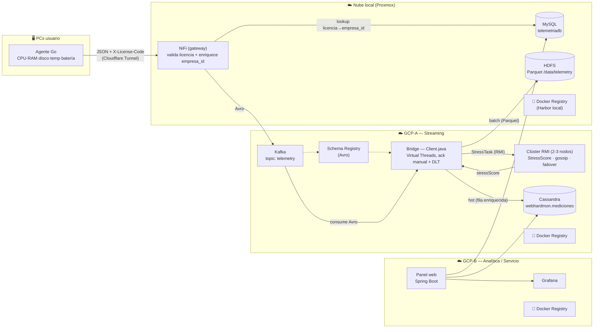

# 🏗️ Arquitectura — WebHardMon (flujo canónico)

> Fuente de verdad del contrato de datos = **`client` (Bridge Java)**. NiFi lo maneja
> nuestro equipo, así que NiFi emite los campos con los nombres que `client` espera
> (no al revés). El `stressScore` **NO** viaja en el payload: se calcula al final, en
> el clúster RMI, y lo añade el bridge.

## Vista de alto nivel

## Flujo paso a paso

1. **Agente Go** (en cada PC) recoge CPU (uso+modelo), RAM (uso+total), disco
   (uso+total), temperatura y **batería**. Envía **JSON** a NiFi con cabeceras
   `X-License-Code` / `X-Portatil`. Entra por **Cloudflare Tunnel** (no por WireGuard).
2. **NiFi (gateway)** valida la licencia contra **MySQL** y enriquece el `empresa_id`.
   Serializa a **Avro** (registrado en Schema Registry) y publica en Kafka topic
   `telemetry`. *El payload NO lleva `stressScore` todavía.*
3. **Bridge (`client/Client.java`)** consume de Kafka (deserializa Avro vía SR sobre
   Virtual Threads):
   - llama al **clúster RMI** con `StressTask` (round-robin + failover) → obtiene `stressScore`.
   - escribe la fila enriquecida en **Cassandra** `webhardmon.mediciones` (GCP-A, hot path).
   - escribe **Parquet en HDFS** `/data/telemetry` (en la **nube local**, alcanzable por
     WireGuard; batch, best-effort: si HDFS falla, Cassandra sigue OK).
   - **ack manual** (commit tras el lote) + **dead-letter** `telemetry.DLT` → semántica *at-least-once*.
4. **Clúster RMI** (2-3 nodos, gossip P2P, sin SPOF): calcula
   `StressScore = 0.4·CPU + 0.4·RAM + 0.2·Disco (+20 si Tª>80 ºC)`, acotado [0,100].
5. **Panel web** (Spring Boot, GCP-B) lee MySQL + Cassandra + Grafana.

3 nubes (Proxmox local · GCP-A streaming · GCP-B analítica) unidas por **WireGuard**.

> **Distribución por nube:** NiFi, MySQL y **HDFS** viven en la **local**; Kafka, Schema
> Registry, el bridge, el clúster RMI y **Cassandra** en **GCP-A**; el panel web y Grafana
> en **GCP-B**. El bridge (GCP-A) escribe Cassandra local a su nube y HDFS cruzando a la
> local por WireGuard.

### Docker Registry por nube

Cada nube tiene su **propio registry** (Harbor en la local + uno en GCP-A y otro en GCP-B).
Las imágenes se construyen y publican con `docker/build-and-push.sh`, que sube cada imagen
al registry de la nube donde se despliega:
- `stressscore` (servidor RMI) y `stressscore-bridge` (cliente) → registry de **GCP-A**.
- `web` (panel) → registry de **GCP-B**.
- imágenes de soporte / base → **Harbor local**.

## Quién calcula / escribe qué (aclaración clave)

| Acción | Componente | Nota |
|---|---|---|
| Validar licencia + enriquecer `empresa_id` | **NiFi** | contra MySQL, antes de Kafka |
| Serializar a Avro y publicar | **NiFi** | topic `telemetry` |
| Calcular `stressScore` | **Clúster RMI** | disparado por el bridge, **después** de Kafka |
| Escribir Cassandra (hot) | **Bridge** | tras el RMI |
| Escribir HDFS Parquet (batch) | **Bridge** | tras el RMI — **NiFi NO escribe Parquet** |

## Puertos

| Servicio | Puerto |
|---|---|
| Kafka | 9092 |
| Schema Registry | 8081 |
| Cassandra | 9042 |
| MySQL | 3306 |
| NiFi | 8080 (UI) / 8081 (ingesta) |
| Grafana | 3000 |
| Matomo | 8282 |
| Panel web | 8080 |
| HDFS NameNode | 9000 |
| RMI | 1099 (registry) / 1100 (objeto) |

## Contrato de datos (gobernado por `client`)

El esquema Avro debe emitir los nombres que `client` lee. **No se pierde ningún dato**
(`procesador` y los textos de RAM/almacenamiento se mantienen). El `stressScore` lo
añade el bridge tras el RMI; no es un campo de ingesta.
