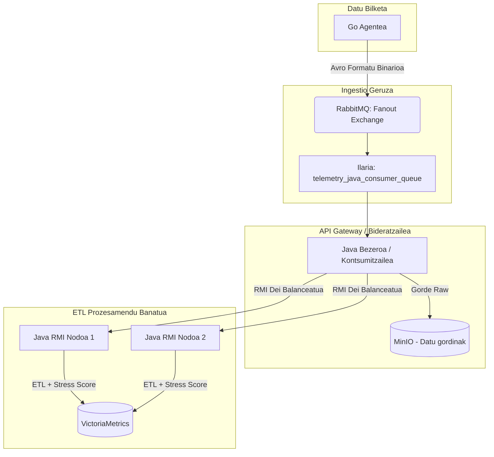

# Sistema Konkurrente eta Banatuak: Telemetria Proiektua

## 1. Arkitekturaren Azalpena (RabbitMQ + Java RMI)

Sistema hau Lambda arkitektura banatu batean oinarritzen da, non datuen ingestioa, biltegiratze gordina (Raw) eta prozesamendua (ETL - Extract, Transform, Load) sekuentzia asinkrono eta banatu batean gertatzen diren.

### Arkitektura Diagrama (Mermaid)

**Faseen fluxua:**
1. **Agentea (Go):** Gailuaren datuak bildu eta Avro formatu estandarrean kodetzen ditu. Ondoren, RabbitMQ-ko `fanout` exchange batera bidaltzen ditu (fire-and-forget).
2. **Ingestioa (RabbitMQ):** Osagaiak desakoplatzen ditu. `fanout` deritzonari esker, etorkizunean ilara anitz konektatu daitezke mezu berdina jasotzeko. Oraingoz, ilara partekatu bakar batera bideratzen du.
3. **Bideratzailea (Java Bezeroa / `Client.java`):** RabbitMQ-tik mezuak hartzen dituen kontsumitzailea da. Sistema asinkronoen zubi gisa jokatzen du: alde batetik daturen jatorrizko bertsioa (Raw/Avro) MinIO datu laku batean biltegiratzen du. Bestetik, ETL lana Java RMI klusterreko edozein nodori delegatzen dio modu orekatuan.
4. **Prozesamendua (Java RMI Zerbitzaria / `ClusterNode.java`):** RMI nodoek (Worker edo langileak) Avro datuak prozesatu (deserialize), erabilpen metrikak atera, ordenagailuaren "Stress Score"-a kalkulatu eta indize hori zein gainerako datuak VictoriaMetrics-en gordetzen simulatzen dute.

---

## 2. "Stress Score" Metrika: Zergatia eta Nola Lortu

Arlo arkitektonikoaren eskakizun gisa, datuak tratatzeko momentuan RMI nodoek **Stress Score** (Estres indizea) izeneko balio bat kalkulatzen dute. Oraindik formula matematiko zehatz bat guztiz definituta ez badago ere, bere sorrerak justifikazio argia du:

### Zergatik definitu da indize hauxe? (Justifikazioa)
Banatutako telemetria sistema batean, nodo baten osasuna neurtzeko aldagai anitz eta heterogeneoak ditugu (PUZ erabilera %, RAM memoriaren bat-bateko kargak, diskoaren irakurketa/idazketa saturazioa, CPU tenperatura...). Administratzaile, alerta-sistema edo Machine Learning algoritmo batentzat konplexua izan daiteke metrika bakoitza banan-banan eta isolatuta behatzea ondorio bat ateratzeko. 

"Stress Score" deritzona egoera hori sinplifikatzeko diseinatu da, gailuaren "sufrimendu" orokorra balio bakar batean (adibidez, 0tik 100era bitarteko eskala batean) laburbiltzen duena:
* **Bistaratzeari erraztasuna ematea:** Grafana bezalako paneletan ikuspegi holistikoa azkar izateko.
* **Alerta goiztiarrak zehaztasunez piztea:** Baliteke CPU-a %90-ean egotea baina tenperatura baxua izatea. Baina CPU-a %80-ean egon arren tenperatura 95ºC-ra iristen bada, "Stress Score" indizeak gora egingo du modu esponentzialean estres egoera argi bat adieraziz.

### Nola lortuko da indize hau? (Inplementazio prozesua)
Logika hau datuen eraldaketarako **ETL** pausoaren barruan (RMI Zerbitzarietan) ematen da:
1. **Erauzketa (Extract):** RMI nodoek RabbitMQ-tik datorren Avro formatuko egitura bitarra askatu eta deserealizatzen dute.
2. **Eraldaketa - Aberastea (Transform):** Pisu zehatz batzuk esleituko zaizkie metrika ezberdinei algoritmo haztatzaile baten bidez (adibidez, tenperaturari biderkatzaile esponentzial bat aplikatuz).
3. **Kargatzea (Load):** Formula matematikoa exekutatu bezain laster, RMI nodoak jatorrizko metrikei "Stress Score" balio berria gehituko die VictoriaMetrics bezalako datu-base bektorial batera bidaltzeko.

---

## 3. Paralelizazioa: Stress Score Kalkulua (Intra-nodo)

Proiektu honetan, **paralelizazioaren ardatz nagusia Stress Score-aren kalkuluan eta datuen esportazioan kokatzen da (RMI Nodoen barruan)**.

### Non aplikatzen da?
Paralelizazioa **RMI Nodoen barnerakoan (Intra-nodo)** aplikatuko da, esplizituki transformazio (Stress Score-aren metrika-kalkulua) eta kargatze (VictoriaMetrics-era bidaltzea) faseetan.

### Zertarako aplikatzen da?
Kalkulu hori era konstantean eta frekuentzia altuarekin (datu-uholde handiekin) exekutatu behar da.
* **Botila-lepoak ekiditeko:** Kalkulua sekuentzialki egingo balitz RMI-aren hari nagusian (Main thread edo metodoaren hartzailean), iristen diren telemetria-eskaera berriak blokeatu egingo lirateke eskuartean dagoen uneko kalkulua amaitu arte.
* **Errendimendua eta Latentzia optimizatzeko (Throughput):** Eskaerak berehala onartu eta prozesamendu astuna atzeko planoan (background) egiteko, gailuaren CPUaren nukleo guztiak (multicore) batera aprobetxatuz errenditzea ahalbidetuz.

### Zein estrategiekin?
Paralelizazioa lortzeko **Thread Pool (Hari-Igerilekua)** estrategia erabiliko da (adibidez, Javako `ExecutorService` inplementatuz).

**Fluxu paralelo asinkronoa:**
1. RMI metodoak Avro bitarra jasotzen du.
2. Hartzaileak ez du Stress Score-a berehala kalkulatzen bere harian. Horren ordez, ataza moduan paketatzen du eta **Thread Pool**-eko hari langile bati (Worker Thread) delegatzen dio bere exekuzioa (adibidez, `submit()` komandoaren bitartez).
3. RMI hartzailea une berean aske geratzen da hurrengo prozesamenduak jasotzeko pareko inolako latentziarik gabe.
4. Bitartean, igerilekuko hariek paraleloan deserealizatzen dute Avroa, Stress Score-aren formula matematikoari ekiten diote eta metrika berriak osatzen dituzte nodo bakoitzaren karga simultaneoki banatuz.

---

## 4. Karga-Banaketa: Round-Robin Estrategia

Arlo arkitektonikora itzuliz, RabbitMQ-tik mezuak hartzen dituen Java Bezeroak (**Client.java**) RMI klusterreko nodo ezberdinei bidali behar die datua ETL prozesua egin dezaten. Bidalketa hori nola eta nori egin erabakitzeko, bezeroak kalkulatutako karga-banaketa (Client-Side Load Balancing) aplikatzen du **Round-Robin** algoritmoaren bidez.

### Nola funtzionatzen du egoera honetan?
Round-Robin estrategia guztiz ziklikoa eta sekuentziala da. Bezeroak eskuragarri dauden RMI nodoen (Workers) zerrenda bat du eta, telemetria datu berri bat iristen denean, zerrendako hurrengo nodoari esleitzen dio enkargua erloju-orratzen zentzuan. 

Adibidez, klusterrean 3 RMI nodo prozesatzaile badaude:
1. Lehenengo telemetria-mezua **Nodo-1**era bidaltzen da.
2. Bigarrena **Nodo-2**ra.
3. Hirugarrena **Nodo-3**ra.
4. Laugarrena, berriz ere, **Nodo-1**era (zikloa itxiz).

### Zergatik erabiltzen da teknika hau? (Justifikazioa)
Hainbat abantaila logiko eta arkitektoniko eskaintzen dizkiolako gure banaketa sistemari:

1. **Kargaren oreka ekitatiboa (Fair Distribution):** Gailu ugariren milaka metrika iristen direnean, bermatzen du inolako RMI nodok ez duela jasaten lan-karga osoa gainerakoak aske dauden bitartean. Prozesamendua eta sare-trafikoa modu uniformean banatzen da kluster osoan zehar.
2. **Deszentralizazioa (Client-Side Load Balancing):** Banaketa algoritmoa bezeroari (*Client.java*) bertari esleitzen diogunez, ez dugu kanpoko elementu gehigarri baten beharrik (adibidez, Nginx, HAProxy edo gailu fisikoren bat). Horrek azpiegituraren konplexutasuna eta saretako jauziak (network hops) murrizten ditu. Latentzia hobetzen da bitartekari bat kentzen delako.
3. **Failover Erraza (Hutsegiteekiko tolerantzia):** Round-Robin egitura estuki lotuta dago hutsegiteen kudeaketarekin. RMI nodoetako bat eroriz gero (demagun Nodo-2 itzali dela), Bezeroak azkar jasoko du konexio-errorea *(Exception)*. Round-Robin egiturari esker, kudeatzaileak errore hori irentsi eta, besterik gabe, zerrendako hurrengo nodora (Nodo-3) bideratuko du datu bera metrika galdu ez dadin (Failover-a), hurrengo bueltetan eroritako nodoa zerrendatik baztertuz.